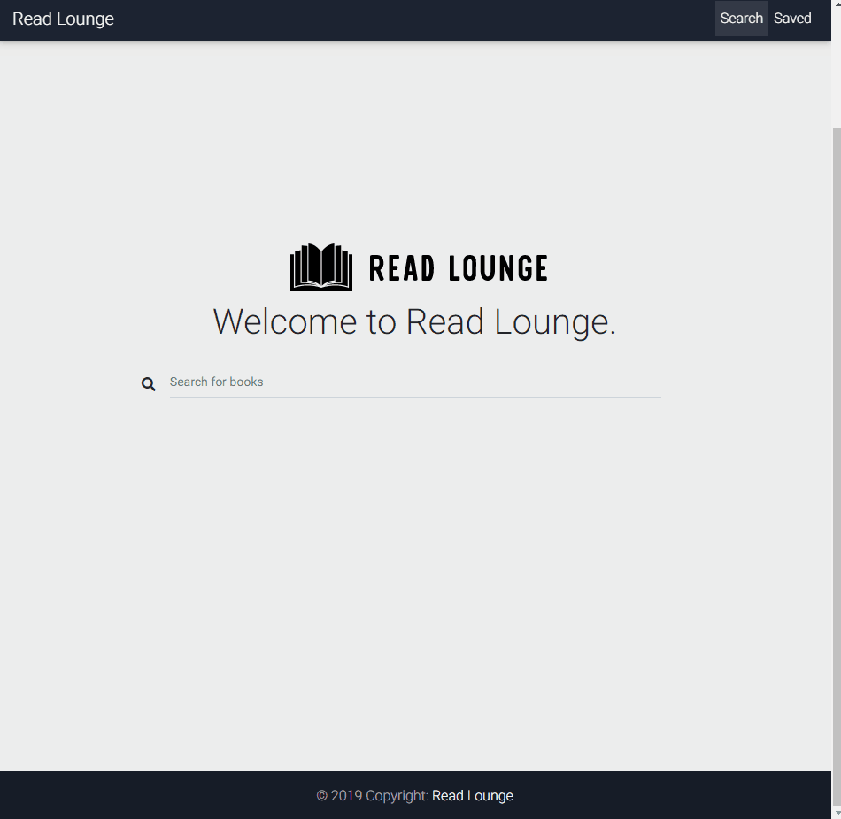

# Read Lounge

React-based Google Books Search app. This assignment requires me to create React components, work with helper/util functions, and utilize React lifecycle methods to query and display books based on user searches. I also used Node, Express and MongoDB so that users can save books to review or purchase later.

## [Try it yourself!](https://readlounge.herokuapp.com/) 



## Getting Started

These instructions will get you a copy of the project up and running on your local machine for development and testing purposes. They will also give an overview of some of the app's functionality. 

### Prerequisites

You will need MongoDB installed if you want to run this application locally. For help installing MongoDB, visit
````
https://docs.mongodb.com/manual/installation/
````

Once installed, make sure the MongoDB daemon is running with the following command line command:
````
$ mongod
````

### Installing

Git clone the repository to your local machine: 

HTTPS:
```
$ git clone https://github.com/pphan93/read-lounge.git
```
SSH:
````
$ git clone git@github.com:pphan93/read-lounge.git
````

To connect to your local Mongo database, you will need to add an .env file in the root of your cloned repository containing the following code:
````
MONGO_DB="mongodb://localhost/<you decide the name here>"
````

Next, cd into the repository you cloned and install the necessary dependencies by running:
````
$ npm install
````

You will then be able to start the app locally by runnning:
````
$ npm start
````

## Built With

* [MongoDB](https://www.mongodb.com/) - NoSQL Database
* [Express.js](https://expressjs.com/) - Node.js framework
* [React.js](https://reactjs.org/) - MVC front-end framework 
* [Node.js](https://nodejs.org/en/) - JavaScript runtime
* [NPM]() - Dependency management
* [MDB Bootstrap](https://mdbootstrap.com/) - HTML/CSS framework

## Authors

Me

